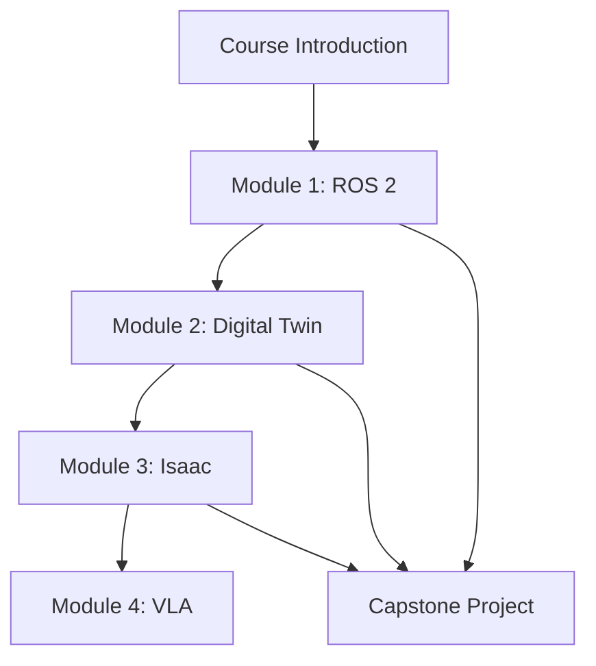

# Data Model: Physical AI & Humanoid Robotics Textbook

## Overview

This document defines the data models for the Physical AI & Humanoid Robotics textbook, focusing on metadata schemas for Modules, Chapters, and Glossary entries. The models ensure consistent content structure, enable automated processing, and support navigation features across the 4-module, 14-chapter curriculum.

## Chapter Metadata Schema

### Core Properties

Each chapter in the textbook follows a standardized frontmatter schema defined in the project constitution:

```yaml
title: "Chapter Title - Descriptive and searchable"
description: "Brief summary of chapter content and learning outcomes"
estimated_time: "Number of hours required to complete chapter"
week: "Week number in 13-week semester (1-13)"
module: "Module identifier (1-4) with name"
prerequisites:
  - "List of prerequisite chapters/weeks"
learning_objectives:
  - "Specific, measurable learning outcome 1"
  - "Specific, measurable learning outcome 2"
  - "Specific, measurable learning outcome 3"
sidebar_label: "Short label for sidebar navigation"
```

### Extended Properties (Optional)

```yaml
difficulty: "Beginner/Intermediate/Advanced"  # Default: Intermediate
tags:
  - "List of technical tags for search"
  - "Example: ros2, python, humanoid"
code_examples:  # Count of embedded code examples
  total: 5  # Number of code blocks
  languages:  # Programming languages used
    - "python"
    - "bash"
    - "yaml"
related_chapters:  # Cross-references to related content
  - "module-1/chapter2"  # Relative path to related chapter
  - "module-2/chapter1"
appendix_references:  # Related appendix sections
  - "appendix-a"
  - "appendix-d"
glossary_terms:  # Key terms defined in this chapter
  - "urdf"
  - "tf-transforms"
  - "zero-moment-point"
```

### Example Chapter Frontmatter

```yaml
---
title: "Nodes, Topics, and Services in ROS 2"
description: "Understanding the fundamental communication patterns in ROS 2 for humanoid robot control"
estimated_time: 4
week: 3
module: "Module 1: ROS 2 Fundamentals"
prerequisites:
  - "intro"
  - "module-1/index"
learning_objectives:
  - "Implement ROS 2 nodes for humanoid robot control"
  - "Design custom message types for humanoid-specific data"
  - "Configure publisher-subscriber patterns for sensor integration"
sidebar_label: "Nodes & Topics"
difficulty: "Intermediate"
tags:
  - "ros2"
  - "python"
  - "communication"
  - "humanoid-robotics"
code_examples:
  total: 8
  languages:
    - "python"
    - "bash"
related_chapters:
  - "module-1/chapter2"
  - "module-2/chapter1"
appendix_references:
  - "appendix-a"
glossary_terms:
  - "node"
  - "topic"
  - "service"
  - "publisher"
  - "subscriber"
---
```

## Module Metadata Schema

### Core Module Properties

Each module represents a major course section and contains multiple chapters:

```yaml
module_id: "1-4"  # Sequential identifier
name: "Module Name with Full Title"
description: "Comprehensive description of module content and objectives"
week_range:
  start: 3  # Starting week
  end: 5    # Ending week
total_chapters: 5  # Number of chapters in module
learning_outcomes:
  - "High-level learning outcome 1"
  - "High-level learning outcome 2"
  - "High-level learning outcome 3"
prerequisites:
  - "List of prerequisite modules/chapters"
estimated_duration: "Total hours for module completion"
capstone_integration: "Description of how module contributes to capstone project"
```

### Module Navigation Properties

```yaml
sidebar_position: 2  # Order in sidebar navigation (1-6: intro + 4 modules + references)
navigation_title: "Short title for navigation"
navigation_description: "Brief description for module overview"
icon: "module-icon-class"  # CSS class for module icon
color: "#123456"  # Primary color for module theme
```

## Glossary Entry Schema

### Core Glossary Properties

Each glossary term follows a standardized structure for consistent definition and cross-referencing:

```yaml
term: "Technical Term Being Defined"
part_of_speech: "noun/verb/adjective/adverb"  # Grammatical classification
pronunciation: "/prəˌnʌnsiˈeɪʃən/"  # IPA pronunciation guide
definition: "Clear, concise definition of the term"
etymology: "Origin and historical context of the term (optional)"
category: "Technical category (e.g., ros2, ai, simulation, hardware)"
related_terms:
  - "List of related terms for cross-referencing"
  - "Example: tf-transforms relates to coordinate-system"
first_mentioned_in: "Path to first chapter where term appears"
use_cases:
  - "Practical application 1"
  - "Practical application 2"
examples:
  - "Example usage in context"
  - "Code example if applicable"
see_also:
  - "Cross-reference to related terms"
  - "Related concepts or chapters"
```

### Extended Glossary Properties

```yaml
acronym_expansion: "Full form of acronym if applicable"
technical_specification: "Detailed technical information"
standards_reference: "Relevant standards (e.g., ROS REP documents)"
alternative_terms:
  - "Synonyms or alternative names"
  - "Regional variations"
visual_representation: "Path to diagram or image if applicable"
difficulty_level: "Beginner/Intermediate/Advanced"
```

### Example Glossary Entry

```yaml
---
term: "URDF"
part_of_speech: "noun"
pronunciation: "/ˈjuːrˌdɛf/"
definition: "Unified Robot Description Format - XML-based format for representing robot models, including kinematic and dynamic properties, visual appearance, and collision geometry."
etymology: "Acronym for Unified Robot Description Format, introduced in early ROS development."
category: "ros2"
related_terms:
  - "xacro"
  - "robot-state-publisher"
  - "tf-transforms"
first_mentioned_in: "module-1/chapter3"
use_cases:
  - "Defining humanoid robot kinematic chains"
  - "Specifying visual and collision models for simulation"
  - "Configuring joint limits and dynamics for control"
examples:
  - "A humanoid robot's URDF file defines its 28 DOF joint structure"
  - "URDF models are loaded by robot_state_publisher to broadcast TF transforms"
see_also:
  - "xacro"
  - "tf-transforms"
  - "module-1/chapter3"
acronym_expansion: "Unified Robot Description Format"
technical_specification: "XML schema with specific tags for links, joints, materials, and transmissions"
standards_reference: "ROS REP-103: Standard Units of Measure and Coordinate Conventions"
difficulty_level: "Intermediate"
---
```

## Content Relationship Model

### Prerequisite Chains

The content follows strict prerequisite relationships to ensure progressive learning:



### Cross-Reference Patterns

```yaml
content_relationships:
  forward_references:  # References to future content
    - "chapter_path: module-2/chapter1"
    - "reason: builds on ROS 2 concepts"
  backward_references:  # References to previous content
    - "chapter_path: module-1/chapter2"
    - "reason: extends topic concepts"
  lateral_references:  # References to parallel content
    - "chapter_path: module-1/chapter4"
    - "reason: related advanced topic"
  appendix_references:  # References to reference materials
    - "appendix_path: appendix-a"
    - "reason: provides migration context"
```

## Search and Indexing Model

### Search Metadata Schema

```yaml
search_metadata:
  title_boost: 1.5  # Weight for title matches
  content_boost: 1.0  # Weight for content matches
  tags_boost: 1.2  # Weight for tag matches
  popularity_score: 0.8  # Based on user engagement
  freshness_score: 0.7  # Based on last update
  relevance_categories:
    - "technical_concept"
    - "implementation_guide"
    - "theoretical_background"
    - "code_example"
```

### SEO Metadata Schema

```yaml
seo_metadata:
  title: "Optimized title for search engines (<60 characters)"
  description: "Meta description for search results (<160 characters)"
  keywords:
    - "List of relevant keywords"
    - "Technical terms and concepts"
  open_graph:
    title: "OG title for social sharing"
    description: "OG description for social sharing"
    image: "Path to social sharing image"
    type: "article"
  twitter_card:
    title: "Twitter card title"
    description: "Twitter card description"
    image: "Path to Twitter card image"
```

## Validation Rules

### Frontmatter Validation

All chapter frontmatter must satisfy these requirements:

1. **Required Fields**: title, description, estimated_time, week, module, learning_objectives, sidebar_label
2. **Type Validation**:
   - estimated_time: number (hours)
   - week: integer (1-13)
   - module: string (valid module identifier)
   - learning_objectives: array of strings (3-5 items)
3. **Format Validation**:
   - title: descriptive, searchable
   - description: concise, informative (50-150 characters)
   - learning_objectives: specific, measurable, achievable
4. **Cross-Reference Validation**:
   - prerequisites must exist
   - related_chapters must exist
   - glossary_terms must be defined

### Content Validation

```yaml
content_validation_rules:
  word_count:
    min: 3000
    max: 5000
    current: 4250
  readability:
    target_grade: 12-14
    current_grade: 13.2
    active_voice_percentage: 75
  citation_compliance:
    total_citations: 12
    peer_reviewed_percentage: 60
    apa_format_compliance: true
  code_example_validation:
    total_examples: 8
    functional_examples: 8
    language_compliance: true
```

## Data Integrity Constraints

### Module-Chapter Relationships

- Each chapter belongs to exactly one module
- Module week ranges must not overlap
- Prerequisite chains must form a directed acyclic graph
- Cross-references must point to existing content

### Glossary Consistency

- Each term defined exactly once
- Cross-references must point to existing terms
- First mention tracking must be accurate
- Category assignments must be consistent

## Performance Considerations

### Search Index Optimization

- Index only essential metadata fields
- Use stemming and synonym expansion
- Implement faceted search capabilities
- Cache frequently accessed content

### Load Performance

- Frontmatter parsing optimized for build speed
- Schema validation performed during content creation
- Pre-computed relationship graphs
- Lazy loading for large content sections

## Migration and Versioning

### Schema Evolution

- Versioned schema definitions
- Backward compatibility maintained
- Migration scripts for schema updates
- Validation against historical versions

### Content Evolution

- Track changes to term definitions
- Maintain historical context for evolving concepts
- Versioned examples for changing APIs
- Deprecation warnings for outdated content

This data model ensures consistent structure across the Physical AI & Humanoid Robotics textbook while enabling advanced search, navigation, and cross-referencing capabilities that enhance the learning experience.