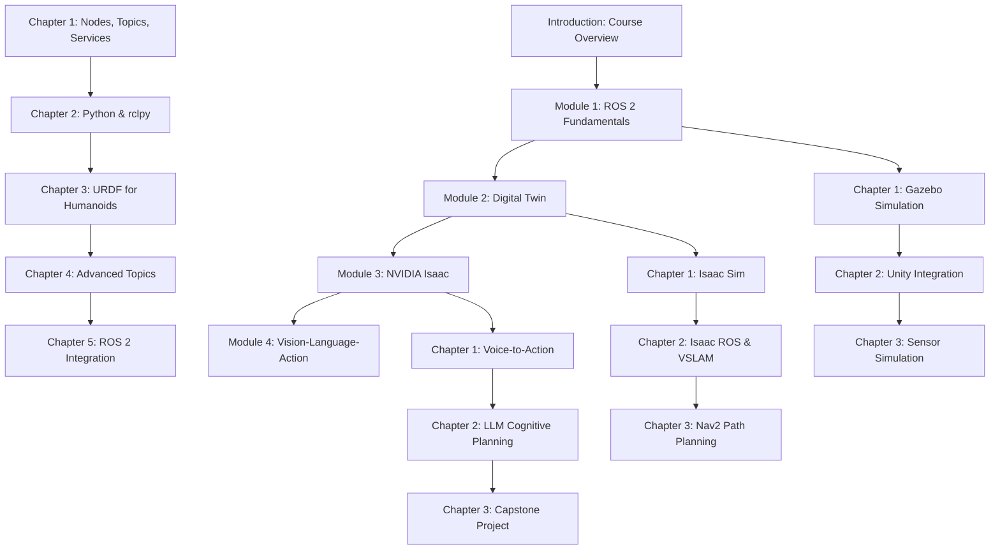

# Prerequisite Map: Physical AI & Humanoid Robotics Textbook

## Overview

This document defines the prerequisite relationships between all 14 chapters in the Physical AI & Humanoid Robotics textbook. The prerequisite structure follows a sequential learning path where each module builds upon the previous ones, with specific dependencies within and between modules.

## Prerequisite Visualization

## Detailed Prerequisites by Chapter

### Module 1: ROS 2 Fundamentals (Weeks 3-5)

#### Chapter 1: Nodes, Topics, Services
- **Prerequisites**:
  - `intro` (Course Introduction)
  - `module-1-ros2/index` (Module 1 Overview)
- **Required by**:
  - Chapter 2: Python & rclpy
  - Chapter 3: URDF for Humanoids
  - Chapter 4: Advanced Topics
  - Chapter 5: ROS 2 Integration

#### Chapter 2: Python & rclpy
- **Prerequisites**:
  - `intro` (Course Introduction)
  - `module-1-ros2/index` (Module 1 Overview)
  - `module-1-ros2/chapter1` (Nodes, Topics, Services)
- **Required by**:
  - Chapter 3: URDF for Humanoids
  - Chapter 4: Advanced Topics
  - Chapter 5: ROS 2 Integration

#### Chapter 3: URDF for Humanoids
- **Prerequisites**:
  - `intro` (Course Introduction)
  - `module-1-ros2/index` (Module 1 Overview)
  - `module-1-ros2/chapter1` (Nodes, Topics, Services)
  - `module-1-ros2/chapter2` (Python & rclpy)
- **Required by**:
  - Chapter 4: Advanced Topics
  - Chapter 5: ROS 2 Integration

#### Chapter 4: Advanced Topics
- **Prerequisites**:
  - `intro` (Course Introduction)
  - `module-1-ros2/index` (Module 1 Overview)
  - `module-1-ros2/chapter1` (Nodes, Topics, Services)
  - `module-1-ros2/chapter2` (Python & rclpy)
  - `module-1-ros2/chapter3` (URDF for Humanoids)
- **Required by**:
  - Chapter 5: ROS 2 Integration

#### Chapter 5: ROS 2 Integration
- **Prerequisites**:
  - `intro` (Course Introduction)
  - `module-1-ros2/index` (Module 1 Overview)
  - `module-1-ros2/chapter1` (Nodes, Topics, Services)
  - `module-1-ros2/chapter2` (Python & rclpy)
  - `module-1-ros2/chapter3` (URDF for Humanoids)
  - `module-1-ros2/chapter4` (Advanced Topics)

### Module 2: Digital Twin (Weeks 6-7)

#### Chapter 1: Gazebo Simulation
- **Prerequisites**:
  - `intro` (Course Introduction)
  - `module-1-ros2` (Complete Module 1)
  - `module-2-digital-twin/index` (Module 2 Overview)
- **Required by**:
  - Chapter 2: Unity Integration
  - Chapter 3: Sensor Simulation

#### Chapter 2: Unity Integration
- **Prerequisites**:
  - `intro` (Course Introduction)
  - `module-1-ros2` (Complete Module 1)
  - `module-2-digital-twin/index` (Module 2 Overview)
  - `module-2-digital-twin/chapter1` (Gazebo Simulation)
- **Required by**:
  - Chapter 3: Sensor Simulation

#### Chapter 3: Sensor Simulation
- **Prerequisites**:
  - `intro` (Course Introduction)
  - `module-1-ros2` (Complete Module 1)
  - `module-2-digital-twin/index` (Module 2 Overview)
  - `module-2-digital-twin/chapter1` (Gazebo Simulation)
  - `module-2-digital-twin/chapter2` (Unity Integration)

### Module 3: NVIDIA Isaac (Weeks 8-10)

#### Chapter 1: Isaac Sim
- **Prerequisites**:
  - `intro` (Course Introduction)
  - `module-1-ros2` (Complete Module 1)
  - `module-2-digital-twin` (Complete Module 2)
  - `module-3-isaac/index` (Module 3 Overview)
- **Required by**:
  - Chapter 2: Isaac ROS & VSLAM
  - Chapter 3: Nav2 Path Planning

#### Chapter 2: Isaac ROS & VSLAM
- **Prerequisites**:
  - `intro` (Course Introduction)
  - `module-1-ros2` (Complete Module 1)
  - `module-2-digital-twin` (Complete Module 2)
  - `module-3-isaac/index` (Module 3 Overview)
  - `module-3-isaac/chapter1` (Isaac Sim)
- **Required by**:
  - Chapter 3: Nav2 Path Planning

#### Chapter 3: Nav2 Path Planning
- **Prerequisites**:
  - `intro` (Course Introduction)
  - `module-1-ros2` (Complete Module 1)
  - `module-2-digital-twin` (Complete Module 2)
  - `module-3-isaac/index` (Module 3 Overview)
  - `module-3-isaac/chapter1` (Isaac Sim)
  - `module-3-isaac/chapter2` (Isaac ROS & VSLAM)

### Module 4: Vision-Language-Action Models (Weeks 11-13)

#### Chapter 1: Voice-to-Action (Whisper)
- **Prerequisites**:
  - `intro` (Course Introduction)
  - `module-1-ros2` (Complete Module 1)
  - `module-2-digital-twin` (Complete Module 2)
  - `module-3-isaac` (Complete Module 3)
  - `module-4-vla/index` (Module 4 Overview)
- **Required by**:
  - Chapter 2: LLM Cognitive Planning
  - Chapter 3: Capstone Project

#### Chapter 2: LLM Cognitive Planning
- **Prerequisites**:
  - `intro` (Course Introduction)
  - `module-1-ros2` (Complete Module 1)
  - `module-2-digital-twin` (Complete Module 2)
  - `module-3-isaac` (Complete Module 3)
  - `module-4-vla/index` (Module 4 Overview)
  - `module-4-vla/chapter1` (Voice-to-Action)
- **Required by**:
  - Chapter 3: Capstone Project

#### Chapter 3: Capstone Project
- **Prerequisites**:
  - `intro` (Course Introduction)
  - `module-1-ros2` (Complete Module 1)
  - `module-2-digital-twin` (Complete Module 2)
  - `module-3-isaac` (Complete Module 3)
  - `module-4-vla/index` (Module 4 Overview)
  - `module-4-vla/chapter1` (Voice-to-Action)
  - `module-4-vla/chapter2` (LLM Cognitive Planning)

## Cross-Module Dependencies

### Foundational Dependencies
- **Module 2** requires completion of **Module 1** (ROS 2 fundamentals needed for simulation)
- **Module 3** requires completion of **Module 2** (simulation concepts needed for Isaac)
- **Module 4** requires completion of **Module 3** (Isaac knowledge needed for VLA integration)

### Parallel Concepts
- **Appendices** can be referenced throughout but are not strict prerequisites
- **Glossary terms** are defined throughout and linked to central glossary
- **Troubleshooting guide** provides support for all modules

## Prerequisite Validation

### Sequential Prerequisites
- Each chapter requires all previous chapters in its module
- Each module requires all previous modules
- Course introduction is prerequisite for all content

### Parallel Prerequisites
- Code standards applied consistently across all modules
- Citation format maintained throughout (APA 7th edition)
- Quality standards consistent across all content

## Dependency Management

### Content Dependencies
- ROS 2 concepts (nodes, topics, services) required for all subsequent modules
- Simulation concepts (Gazebo, Unity) required for Isaac and VLA modules
- Perception concepts (VSLAM) required for navigation in Isaac module
- AI concepts (LLMs, VLA) integrated in final module

### Technical Dependencies
- ROS 2 Humble LTS required throughout
- Isaac Sim 4.0+ for Module 3
- Gazebo Fortress for Module 2
- Python 3.10+ for all modules

## Validation Checklist

- [x] All 14 chapters have clearly defined prerequisites
- [x] Prerequisite chains follow logical progression (Module 1 → 2 → 3 → 4)
- [x] Within-module prerequisites follow sequential order
- [x] Foundational concepts (ROS 2) required before advanced concepts
- [x] Simulation concepts precede Isaac and VLA integration
- [x] Each chapter lists specific prerequisite chapters
- [x] Dependencies support capstone project integration
- [x] Prerequisites align with 13-week semester timeline
- [x] Cross-module dependencies clearly identified
- [x] Parallel concepts identified and managed

This prerequisite map ensures students follow a logical learning progression that builds from foundational concepts to advanced applications, with each chapter building upon previous knowledge while maintaining clear dependency relationships.